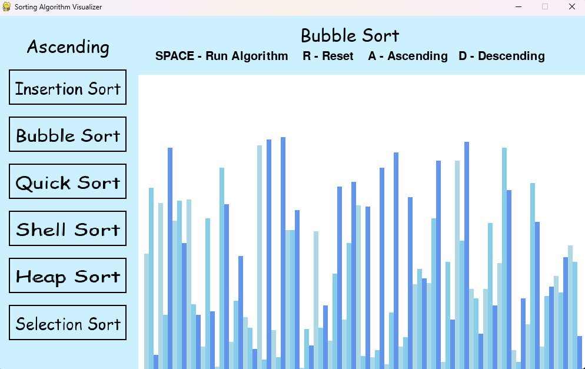

# Sorting algorithm visualizer
This is a sorting algorithm visualizer
## Table of Contents

- [Features](#features)
- [Installation](#installation)
- [Usage](#usage)
- [Screenshots](#screenshots)

## Features

- 6 Sorting Algorithms
- Sort by ascending or descending order

## Installation
To run this application loacally, follow these steps:

1. Clone this repository:

    ```
    git clone https://github.com/mespino4/SortAlgoVizualzr
    ```
    
2. Install PyGame if you dont already have it installed:

    ```
    pip pygame
    ```

2. Run the Python file:

    ```
    python main.py
    ```

## Usage

To use this application follow these steps

1. Run the python file
2. Select and algorithm from the left sidebar
3. Select how you want the algorithm to sort the bars, press either A for Ascending or D for Descending
4. Press the spacebar to run the algorithm
5. Press R key to reset the bars and select another algorithm

## Screenshots




